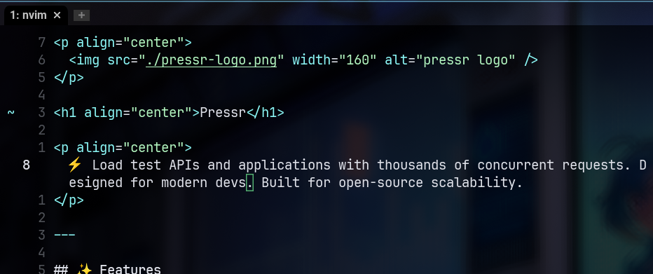

# pressr

A fast and flexible load testing tool for APIs and applications.

`pressr` is designed to help discover and replicate edge cases that only appear under load conditions, providing detailed reports on response times, errors, and other performance metrics.

## Features

- Send large numbers of HTTP requests to test API and application performance
- Specify concurrency level and request parameters
- Use custom data files for dynamic request content
- Generate detailed reports on response times, status codes, and errors
- Robust error handling with detailed context
- Structured logging with configurable verbosity
- Command-line interface with rich options

## Installation

### From Source
```bash
git clone https://github.com/yourusername/pressr.git
cd pressr
cargo install --path crates/pressr-cli
```

## Usage

Basic usage:
```bash
pressr --url https://api.example.com/endpoint
```

Advanced usage:
```bash
pressr --url https://api.example.com/endpoint \
       --method post \
       --requests 1000 \
       --concurrency 20 \
       --data-file request-data.json \
       --header "Content-Type: application/json" \
       --header "Authorization: Bearer token" \
       --timeout 60 \
       --output json \
       --verbose
```

### Command Line Options

- `-u, --url <URL>`: Target URL to send requests to (required)
- `-m, --method <METHOD>`: HTTP method [default: get]
- `-r, --requests <COUNT>`: Number of requests to send [default: 100]
- `-c, --concurrency <COUNT>`: Number of concurrent requests [default: 10]
- `-d, --data-file <PATH>`: Path to a JSON/YAML file with request data
- `-H, --header <HEADER>`: HTTP headers in "key:value" format (can be used multiple times)
- `-t, --timeout <SECONDS>`: Request timeout in seconds [default: 30]
- `-o, --output <FORMAT>`: Output format (text, json) [default: text]
- `-v, --verbose`: Enable verbose logging for debugging
- `-h, --help`: Print help
- `-V, --version`: Print version

## License

This project is licensed under [TODO: Add license].

<p align="center">
  
</p>

---

<p align="center">
  ⚡️ Load test APIs and applications with thousands of concurrent requests. Designed for modern devs. Built for open-source scalability.
</p>

---

## ✨ Features

- 🚀 High-concurrency request engine
- 📊 Tracks response times, errors, and full output
- 🧠 Minimal, scriptable interface (CLI-first)
- 🔧 Robust error handling with detailed context
- 📝 Structured logging with configurable verbosity
- 🧪 Perfect for CI pipelines, stress tests, and perf validation
- 🌐 Web-ready architecture (future: browser-based load tests)
- 🔧 Cross-compiled binaries: Windows `.exe`, macOS `.dmg`, Linux
- 🛠 Open source, minimal dependencies

---

## 🔧 Example Usage

```sh
pressr run \
  --url https://api.example.com/endpoint \
  --method POST \
  --body '{"key": "value"}' \
  --concurrency 1000 \
  --duration 30s

